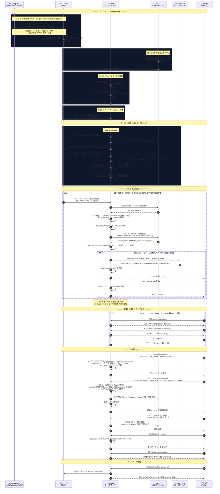

```mermaid
sequenceDiagram
    autonumber
    participant HF as HuggingFace<br/>(agkphysics/AudioSet)
    participant DISK as ストレージ<br/>(data/)
    participant API as FastAPI<br/>(バックエンド)
    participant GPU as GPU<br/>(CLAP + Faiss)
    participant LLM as Qwen2.5-7B<br/>(ローカルLLM)
    participant UI as ブラウザ<br/>(React)

    Note over HF,UI: ===== パイプライン: make pipeline =====

    rect rgb(15, 23, 42)
    Note over HF,DISK: Step 1: AudioSetダウンロード (scripts/download_dataset.py)
    HF->>DISK: HuggingFace datasets ライブラリでストリーミング取得<br/>(balanced ~22K / unbalanced ~2M clips)
    Note over HF,DISK: Audio(decode=False) で生バイト取得<br/>→ soundfile で WAV 変換・保存
    DISK->>DISK: metadata.jsonl 生成 (filename + human_labels)
    end

    rect rgb(15, 23, 42)
    Note over GPU: Step 2: CLAP埋め込み (GPU)
    GPU->>GPU: 全音声を512次元ベクトルに変換<br/>(ClapModel.embed_batch)
    GPU->>DISK: embeddings.npy + metadata.jsonl
    end

    rect rgb(15, 23, 42)
    Note over API: Step 3: Faissインデックス構築
    API->>API: categories.pyのカテゴリマッピングで<br/>センサー振り分け (urban/indoor/park)
    API->>API: L2正規化 (faiss.normalize_L2) →<br/>Inner Product (コサイン類似度) で IVFFlat 構築
    API->>DISK: {sensor_id}_baseline.faiss + {sensor_id}_metadata.jsonl
    end

    rect rgb(15, 23, 42)
    Note over API: Step 4: ベースライン/テスト分離
    API->>DISK: 70%ベースライン / 30%ストリーム<br/>ストリームに10%異常音混入
    end

    Note over DISK,UI: ===== サーバー起動: make dev (lifespan) =====

    rect rgb(15, 23, 42)
    Note over API: lifespan startup
    API->>DISK: 永続化 state のロード (load_state)
    API->>GPU: CLAPモデルロード (audio encoder + text encoder)
    API->>DISK: センサー別Faissインデックスをロード<br/>(data/index/{sensor_id}_baseline.faiss + metadata.jsonl)
    API->>DISK: デフォルトFaissインデックスをロード<br/>(data/index/default_baseline.faiss)
    API->>LLM: LLMクライアント初期化 (LLM_ENABLED=true時)
    API->>API: init_detection_context で検知コンテキスト設定<br/>(sensors, alerts, score_history, clap, indices, llm)
    API->>API: asyncio.create_task(run_detection_loop)<br/>+ done_callback でクラッシュ時自動再起動
    end

    Note over DISK,UI: ===== リアルタイム検知ループ =====

    loop DETECTION_INTERVAL_SEC ごと (GPU:3秒 / CPU:300秒)
        DISK->>API: ストリームから次の音声読み込み<br/>(センサー別カーソルで巡回)
        API->>GPU: CLAP audio encoder で埋め込み
        GPU-->>API: 512次元ベクトル

        API->>API: L2正規化 → Faiss Inner Product で最近傍5件検索<br/>max_similarity = max(similarities)
        API->>API: baseline_distance = 1 - max_similarity

        API->>GPU: CLAP text encoder で無音検知<br/>("silence" 単一テキストのベクトルをキャッシュ)
        GPU-->>API: silence_sim = dot(audio_norm, silence_vec)
        API->>API: silence_sim > 0.45 なら distance = 1.0 に強制 (バイナリ判定)

        alt distance >= 0.55 (ANOMALY_THRESHOLD: 異常)
            API->>LLM: AnomalyResult + Sensor情報 → generate_intent
            LLM-->>API: Intent JSON (judgment, recommendation, urgency, supplement)
            API->>API: asyncio.Lock で Alert を追加
            API-->>UI: アラート + 心電図スパイク
        else distance < 0.55 (正常)
            API->>API: asyncio.Lock で ScoreEntry を追加
            API-->>UI: 正常スコア更新
        end
    end

    Note over API: モデル未ロード or 音声なし時は<br/>シミュレーションモードで疑似スコア生成

    Note over DISK,UI: ===== フロントエンド ポーリング =====

    loop VITE_POLL_INTERVAL ごと (GPU:2秒 / CPU:5秒)
        UI->>API: GET /api/sensors/status
        API-->>UI: 各センサーの状態 (SensorStatus[])
        UI->>API: GET /api/sensors/scores?limit=100
        API-->>UI: 時系列スコア (ScoreEntry[])
        UI->>API: GET /api/alerts
        API-->>UI: アラート一覧 (Alert[], 新しい順)
    end

    Note over DISK,UI: ===== デモ操作 (UI) =====

    UI->>API: POST /api/demo/simulate<br/>{scenario: "hvac_failure", duration_points: 10}
    API->>API: シナリオ別スコア生成 (normal/hvac_failure/unusual_activity)<br/>+ LLM intent 生成 (失敗時はハードコード fallback)<br/>+ asyncio.Lock で state 更新
    API-->>UI: グラフ + アラート更新

    UI->>API: POST /api/demo/generate<br/>{sensor_id: "indoor", sound_type: "anomaly", auto_detect: true}
    API->>API: センサー環境別ランダム音声生成<br/>(normal: 環境音 / silence: 微弱ノイズ / anomaly: 擬似音声)<br/>→ data/tmp/ に一時ファイル保存
    API->>GPU: CLAP埋め込み → Faiss Inner Product 検索 + 無音検知
    API->>API: 一時ファイル自動削除
    API-->>UI: 距離スコア + 異常判定結果

    UI->>API: POST /api/demo/detect<br/>{sensor_id: null (全センサー)}
    API->>GPU: 指定/全センサー即時検知<br/>(_detect_one_sensor を直接呼び出し)
    API-->>UI: 結果反映

    UI->>API: POST /api/demo/reset
    API->>API: asyncio.Lock で ALERTS + SCORE_HISTORY クリア
    API-->>UI: グラフ + アラート クリア

    UI->>API: GET /api/demo/scenarios
    API-->>UI: 利用可能なシナリオ一覧 (Scenario[])

    Note over DISK,UI: ===== ベースライン情報 =====

    UI->>API: GET /api/baseline/{sensor_id}
    API->>DISK: Faissインデックスファイルのstat取得
    API-->>UI: Baseline (sample_count, created_at, index_path)
```
